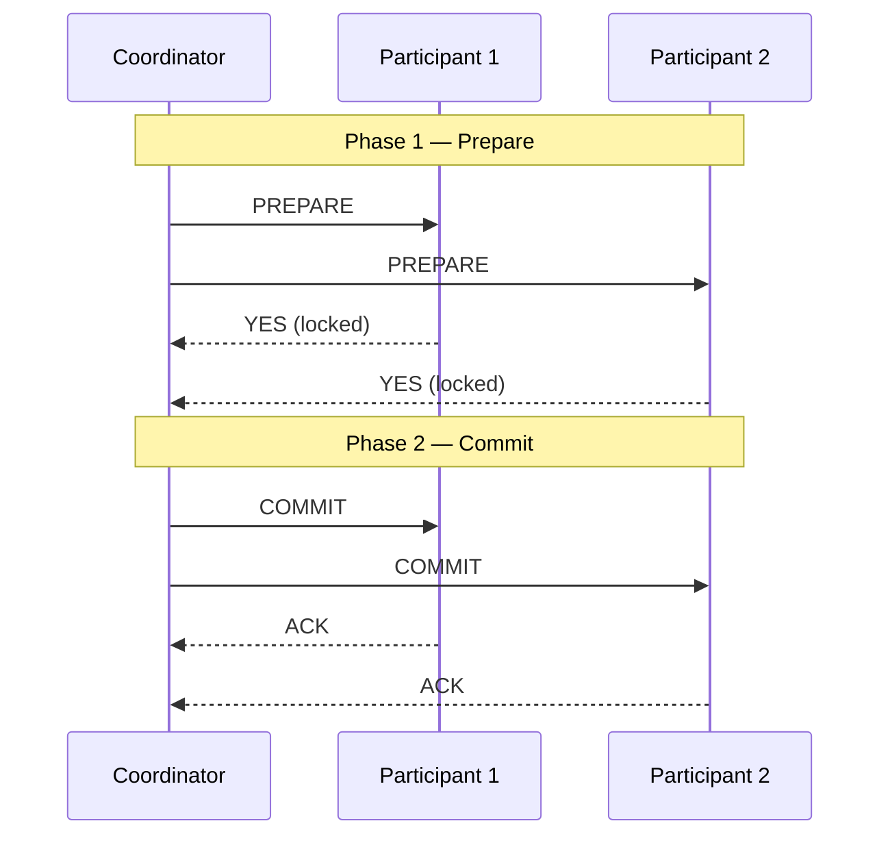
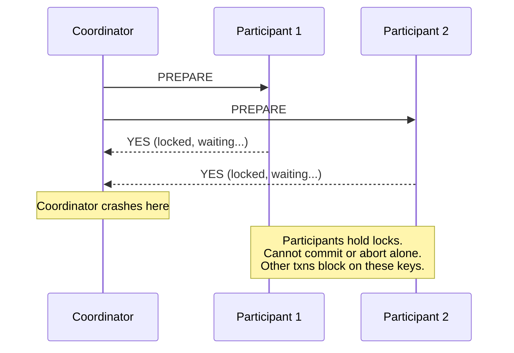
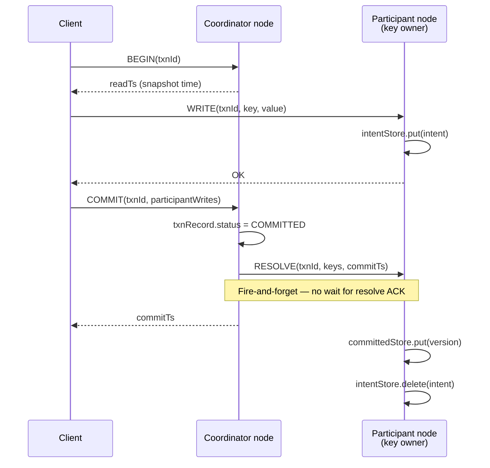
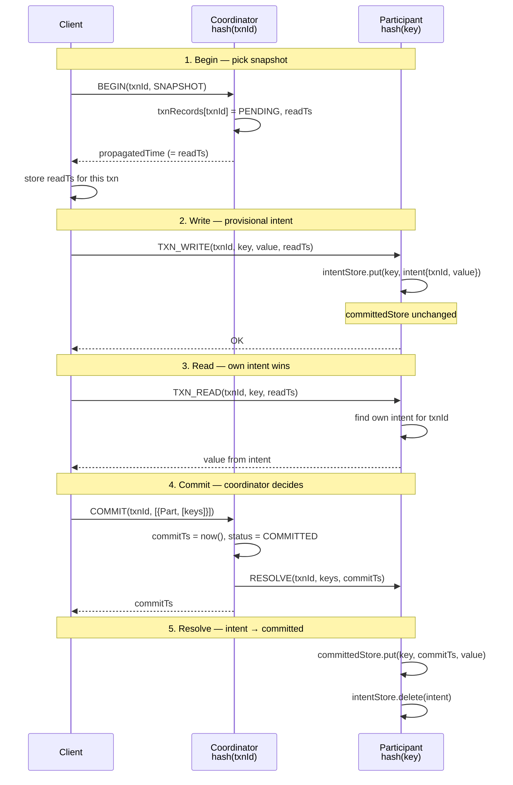
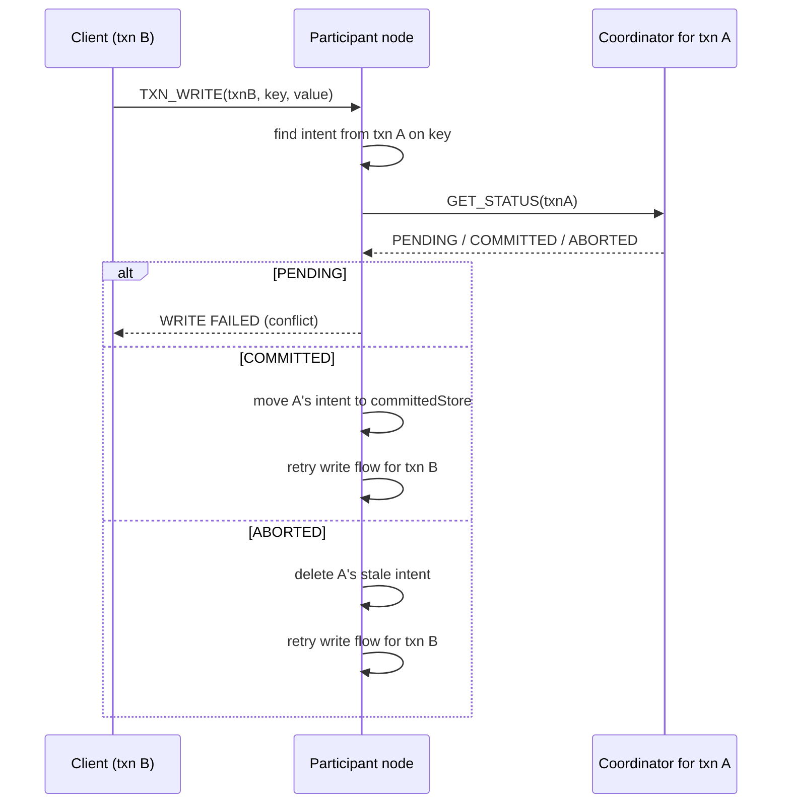
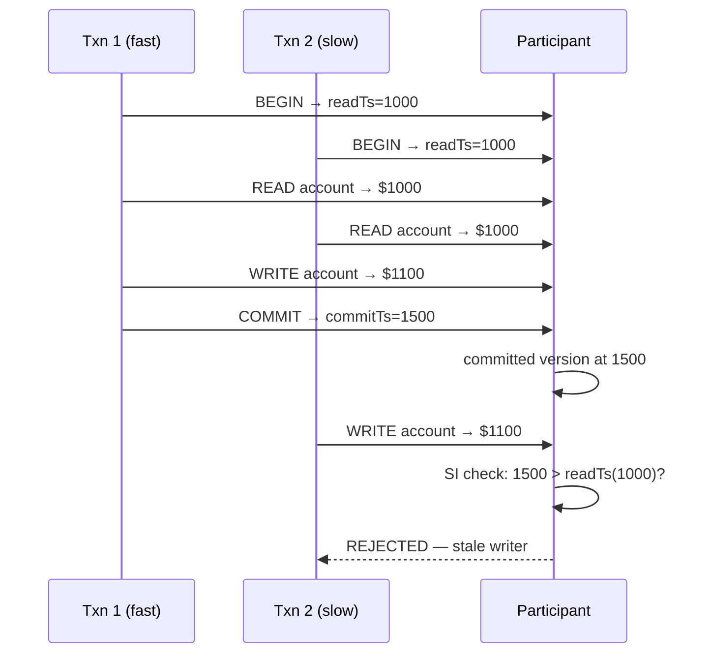
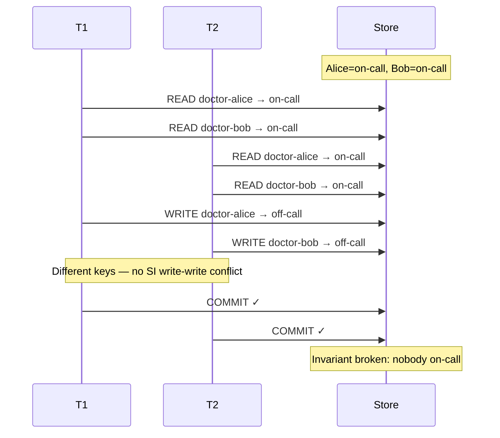

# 04 — Distributed Transactional Key-Value Store

Module `03` gave us a distributed MVCC store: route a key to the right node, read or write a version, propagate HLC timestamps. Every operation was independent. There was no `BEGIN`, no `COMMIT`, no guarantee that two writes happened atomically or that a read saw a consistent slice of the database.

This module adds **transactions**. A client opens a transaction, reads and writes keys (possibly on different nodes), then commits. Writes are **provisional** until commit. Reads see a fixed **snapshot** plus the transaction's own uncommitted writes. On commit, a **coordinator** marks the transaction committed and tells participant nodes to move intents into the committed store.

We're implementing **Snapshot Isolation (SI)** here — not full serializability yet. That comes in module `06`. We also don't handle clock-uncertainty read restart yet — that's module `05`.

This is the core hands-on module of the workshop. Expect to implement pieces of `TransactionalStorageReplica.java` and run tests until they pass. See [EXERCISE.md](EXERCISE.md) for the step-by-step path.

---

## What we're building (in one picture)

Each storage node has **two** MVCC stores:

```
┌─────────────────────────────────────────┐
│  TransactionalStorageReplica (one node) │
│                                         │
│  committedStore  ← durable, visible     │
│                    versions after commit│
│                                         │
│  intentStore     ← provisional writes   │
│                    from in-flight txns  │
│                                         │
│  txnRecords      ← in-memory coordinator│
│                    state (one node only)│
└─────────────────────────────────────────┘
```

- **`committedStore`** — what the world looks like after transactions commit. Snapshot reads (for other transactions) come from here.
- **`intentStore`** — write intents. A key with an intent means "some transaction *might* commit this value." Intents block or complicate other operations until resolved.
- **`txnRecords`** — lives only on the node that plays **coordinator** for a given `txnId`. Tracks `PENDING` / `COMMITTED` / `ABORTED`, read timestamp, commit timestamp.

The client (`TransactionalStorageClient`) tracks which keys it wrote on which participant nodes, so commit can send resolve requests to the right places.

---

## Why not classic Two-Phase Commit (2PC)?

In a talk around this material, 2PC often comes up as the "obvious" way to commit a distributed transaction. Worth understanding why this workshop — and systems like CockroachDB — do something different.

### What 2PC looks like

Classic **two-phase commit** has a coordinator and participants:

**Phase 1 — Prepare (vote):** Coordinator asks every participant: "Can you commit?" Each participant writes a prepare record, acquires locks, and votes yes or no.

**Phase 2 — Commit or abort:** If everyone voted yes, coordinator says commit. Otherwise abort. Participants apply the decision and release locks.



Looks clean. The problem is failure.

### The blocking problem

If the **coordinator crashes after participants have voted YES** but before sending COMMIT, participants are stuck. They voted "I can commit" and hold locks. They don't know whether the transaction ultimately committed or aborted. They must **block**, waiting for the coordinator to recover. Other transactions that touch those keys can stall indefinitely.



This is 2PC's famous **blocking** flaw. It's why production OLTP systems moved to variants that don't leave shards holding indefinite locks waiting for a single coordinator's fate.

There are mitigations (3PC, Paxos/Raft-backed transaction records, coordinator failover with durable logs), but the core tension remains: **tight prepare/commit coupling + coordinator as single point of ambiguity = blocking under failure.**

### What this module does instead

We use a **transaction record + provisional intents** model, closer to CockroachDB's approach than to textbook blocking 2PC:

1. **Begin** — coordinator creates an in-memory `TxnRecord` (`PENDING`). Cheap, no cross-node prepare vote.
2. **Write** — participant stores an **intent** in `intentStore`, not in `committedStore`. The value is visible to the writing transaction (read-your-own-writes) but not to others' snapshot reads.
3. **Commit** — coordinator picks a commit timestamp, marks `TxnRecord` as `COMMITTED`, and **fires resolve requests** to participants. Participants move intents → committed store.
4. **Lazy resolution** — if a read or write hits someone else's unresolved intent, we ask that transaction's coordinator for status and resolve or conflict on the spot.

Important detail from the code: **we do not wait for resolve responses during commit.** The client gets commit ACK once the coordinator has marked the transaction committed and sent resolve messages. Resolution is asynchronous. That's a deliberate simplification — and another departure from 2PC's "everyone must ACK phase 2 before success."



No prepare-phase lock vote. No indefinite blocking if the coordinator disappears mid-commit (though unresolved intents and coordinator records have their own cleanup story — we use tick-based timeouts to evict abandoned `TxnRecord`s). The tradeoff: more subtle read/write paths, intent resolution logic, and snapshot validation rules.

---

## Routing: two different hashes

Module `03` routed by `hash(key)`. Now we have two routing decisions:

| What | Route by | Example |
|------|----------|---------|
| **Coordinator** for a transaction | `hash(txnId) % numNodes` | `txn-1` → `storage-node-2` |
| **Participant** for a key | `hash(key) % numNodes` | `"account-101"` → `storage-node-1` |

```java
// ReplicaRouting.java
coordinatorFor(txnId)  →  replicas.get(floorMod(txnId.hashCode(), n))
replicaFor(key)        →  replicas.get(floorMod(key.hashCode(), n))
```

A single transaction often touches **multiple nodes**. The client writes `"account-101"` on node 1 and `"account-202"` on node 2, but commit goes to whichever node owns `txnId`. The client bundles `List<ParticipantWrites>` — "on node 1 I wrote these keys, on node 2 those keys" — into the commit request.

The coordinator record starts with an **empty** participant set at begin time. Participants are discovered as writes happen. Only at commit does the coordinator know the full footprint.

---

## Transaction lifecycle — happy path

Here's a full pass: begin, write, read your own write, commit, resolve.



### Begin

Client sends `BeginTransactionRequest(txnId, isolationLevel, clientTime)` to `coordinatorFor(txnId)`.

Coordinator merges the client clock, creates a `TxnRecord`:

```java
TxnRecord(txnId, PENDING, readTimestamp=propagatedTime, commitTimestamp=null, ...)
```

The `propagatedTime` returned to the client becomes the transaction's **snapshot timestamp** (`readTs`). All reads in this transaction use that fixed point — committed data visible at `readTs`, not at "now."

### Provisional write

Client sends `TxnWriteRequest(txnId, key, value, readTs, clientTime)` to `replicaFor(key)`.

Participant stores in **`intentStore`**, not `committedStore`:

```java
intentStore.put(MVCCKey(key, intentTimestamp), IntentRecord(txnId, value))
```

Other transactions' snapshot reads don't see this yet. Your own transaction does — that's read-your-own-writes.

### Transactional read

Order of checks in `beginRead`:

1. **Own intent?** Return it. Don't compare intent timestamp to `readTs` — intents are stamped at write time, which is usually *after* `readTs`. Requiring `intentTs ≤ readTs` would break read-your-own-writes.
2. **Someone else's intent?** Ask their coordinator for status (see intent resolution below).
3. **Otherwise** — `committedStore.getAsOf(key, readTs)`.

### Commit and resolve

Client sends `CommitTransactionRequest(txnId, participantWrites, clientTime)` to the coordinator.

Coordinator:

1. Sets `TxnRecord.status = COMMITTED`, assigns `commitTimestamp`
2. Sends `ResolveTransactionRequest` to each participant (fire-and-forget)
3. Returns `CommitTransactionResponse` to client

Each participant's `resolve`:

```java
committedStore.put(versionedKey(key, commitTimestamp), value);
intentStore.delete(intent);
```

---

## Intent resolution — when you meet someone else's write

A key with a lingering intent is ambiguous: maybe that transaction will commit, maybe it will abort. Reads and writes that encounter another transaction's intent can't proceed blindly.

They send `GetTransactionStatusRequest` to **that transaction's coordinator** and branch on the answer:

| Status | On write | On read |
|--------|----------|---------|
| `PENDING` | **Fail** — conflicting in-flight transaction | **Ignore** intent, read committed snapshot |
| `COMMITTED` | Resolve intent → committed store, **retry** write | Resolve intent, then read committed |
| `ABORTED` | Delete stale intent, **retry** write | Delete stale intent, read committed |



Why reads ignore `PENDING` intents but writes fail: a snapshot read at `readTs` is allowed to pretend in-flight writes don't exist yet. A write is making a decision that could conflict — if someone else is mid-write on the same key, safer to reject and retry.

**HLC propagation matters here.** The status RPC carries timestamps. When txn A's coordinator merges the incoming clock, it gets pushed forward. That affects A's eventual `commitTimestamp` — which feeds into the lost-update prevention rule below. See `lost_update_scenarios.md` in this module for two detailed walkthroughs.

---

## Snapshot Isolation and lost updates

SI gives each transaction a stable snapshot (`readTs`). Re-reading the same key in the same txn always sees the same data. Range scans are consistent with that snapshot.

What SI **does** prevent: **lost update on the same key**. Two transactions read the same value, both try to write — the first committer wins, the second is rejected.

The rule in code (`failsSnapshotIsolationWriteValidation`):

> Before writing key `k`, check whether `committedStore` already has a version of `k` with timestamp **strictly greater than** this transaction's `readTs`. If yes, reject the write.

```java
// First-committer-wins
if (committedTimestamp.compareTo(readTimestamp) > 0) {
    sendWriteFailure("Conflicting committed transaction");
}
```

**Example:** balance is $1000. T1 and T2 both read it. T1 commits a write at commitTs=1500. T2 (readTs=1000) tries to write → sees committed version at 1500 > 1000 → **rejected**. T1's update isn't silently overwritten.



For the subtler case where clock skew would let a slow coordinator commit *below* a reader's snapshot — HLC propagation during reads pushes clocks forward so commits land above observing transactions. `SnapshotIsolationLostUpdatePreventionTest` and `lost_update_scenarios.md` cover this.

See also [isolation-level.md](isolation-level.md) for a broader comparison of isolation levels.

---

## What SI still allows: write skew

SI does **not** prevent **write skew**. Two transactions read overlapping state, write **different keys**, and both commit — breaking an application invariant.

Classic example from `SnapshotIsolationAnomalyTest`:

- Two doctors are on-call. Invariant: at least one must be on-call.
- T1 reads Alice=on-call, Bob=on-call. Writes Alice=off-call.
- T2 reads the same. Writes Bob=off-call.
- No **same-key** write conflict → both commits succeed → zero doctors on-call.



Module `06-serializable-txn` adds machinery to catch this. Module `04` intentionally lets it through so you can see the gap.

---

## Code layout

```
src/main/java/com/distrib/txn/kv/
  TransactionalStorageClient.java    — smart client: begin, read, write, commit, routing
  TransactionalStorageReplica.java — storage node + coordinator logic
  ReplicaRouting.java              — hash(txnId), hash(key)
  TxnRecord.java, IntentRecord.java, TxnId.java, TxnStatus.java
  IsolationLevel.java
  *Request.java / *Response.java   — RPC payloads
  TransactionalMessageTypes.java

src/test/java/com/distrib/txn/kv/
  TransactionalStorageReplicaCoreFlowTest.java   — exercises 1–4
  SnapshotIsolationLostUpdatePreventionTest.java — exercise 5
  TransactionalStorageReplicaReadResolutionTest.java
  TransactionalStorageReplicaWriteResolutionTest.java
  SnapshotIsolationAnomalyTest.java
  ClockUncertaintySnapshotTest.java
  dsl/                                         — scenario DSL for lost-update demos

isolation-level.md
lost_update_scenarios.md
si_hlc_vs_timestamp_oracle_spec.md
```

---

## `TransactionalStorageClient` — the smart client

This workshop uses a **smart client** model: the client knows cluster membership and routes directly to coordinator vs participant nodes. (A **thin client** would talk to any node and let the server forward — common in production, but routing would be less visible in the code.)

The client tracks:

- `transactionStartTimestamps` — `readTs` per `txnId`, set on successful begin
- `writesByParticipant` — which keys were written on which nodes, fed into commit as `ParticipantWrites`

Every read/write passes `readTs` from begin. Every RPC stamps `hybridClock.now()` and ticks on response — same HLC propagation as module `03`.

---

## `TransactionalStorageReplica` — the meat

Each node is both a **shard owner** (for keys hashed to it) and potentially a **coordinator** (for txnIds hashed to it). A node can be one, the other, or both for a given operation.

`onTick` evicts `TxnRecord`s whose heartbeat timeout fired — abandoned transactions don't live forever in coordinator memory.

Key methods you'll implement in the exercises:

| Exercise | What | Code marker |
|----------|------|-------------|
| 1 | `beginTransaction` — create `PENDING` record | `// TODO: Exercise 1` |
| 2 | `writeIntent` — put in `intentStore` | `// Exercise 2` |
| 3 | `beginRead` — own intent, then committed at `readTs` | `// Exercise 3` |
| 4 | `commitTransaction` — mark committed, send resolves | `// Exercise 4` |
| 5 | `failsSnapshotIsolationWriteValidation` | `// Exercise 5` |

Intent resolution (`checkAndResolveIntents`) is provided — study it for the follow-on exercises.

---

## Walking through the core tests

**`TransactionalStorageReplicaCoreFlowTest.beginTransactionCreatesPendingTxnRecordOnCoordinator`**
Begin on coordinator. Assert `TxnRecord` exists, status `PENDING`, isolation level set, timeout ticking, empty participant set.

**`txnWriteStoresIntentAndReadReturnsOwnIntent`**
Write goes to `intentStore` only. Read in same txn returns the intent value before commit. `committedStore` still empty.

**`txnReadCommittedValuesAtReadTimestamp`**
Pre-seed committed data at T=900. Begin at T=1000. Read returns the T=900 value (visible at snapshot).

**`commitMovesIntentToCommittedStoreAndMarksTransactionCommitted`**
After commit: coordinator shows `COMMITTED`, intent gone, value in `committedStore` at `commitTimestamp`.

**`SnapshotIsolationLostUpdatePreventionTest`**
Two clients, skewed clocks, same key. Leading txn commits first. Lagging txn's write rejected by SI validation.

**`SnapshotIsolationAnomalyTest`**
Write skew demo — both txns commit, invariant broken.

**`ClockUncertaintySnapshotTest`**
Shows a snapshot read can miss a value when clock skew puts a write inside the uncertainty window. Motivates module `05`.

---

## 2PC vs this design — quick comparison

| | Classic 2PC | This module |
|---|-------------|-------------|
| Prepare vote | All participants lock and vote before commit | No prepare phase |
| Commit coupling | Client success often waits for all ACKs | Commit ACK before resolve completes |
| Coordinator crash | Participants can block indefinitely | No prepare locks; intents + txn records instead |
| Visibility | Usually all-or-nothing at commit | Intents visible to writer; others see on resolve |
| Conflict detection | Locks during prepare | SI validation + intent status checks |

Neither is "free." Intent-based designs need lazy resolution, transaction status lookups, and careful timestamp rules. 2PC needs coordinator recovery protocols and still struggles with blocking. Production systems (CockroachDB, Spanner, Yugabyte) blend MVCC, distributed txn records, and per-key locking or validation in ways that avoid classic blocking 2PC while keeping correctness.

---

## Exercise path

See [EXERCISE.md](EXERCISE.md). Suggested order:

1. Begin transaction
2. Provisional write
3. Transactional read
4. Commit and resolve
5. SI write-write validation
6. Follow-on: read/write intent resolution tests
7. Follow-on: anomaly and clock uncertainty tests (discussion)

```bash
./gradlew :04-distrib-txn-kv:test
```

Single exercise:

```bash
./gradlew :04-distrib-txn-kv:test --tests com.distrib.txn.kv.TransactionalStorageReplicaCoreFlowTest.beginTransactionCreatesPendingTxnRecordOnCoordinator
```

---

## Further reading in this module

- [isolation-level.md](isolation-level.md) — anomaly matrix across isolation levels
- [lost_update_scenarios.md](lost_update_scenarios.md) — two HLC clock-skew scenarios step by step
- [si_hlc_vs_timestamp_oracle_spec.md](si_hlc_vs_timestamp_oracle_spec.md) — timestamp oracle vs HLC for SI

---

## What comes next

**`05-clock-uncertainty-and-read-restart`** — HLC timestamps have an uncertainty window. A snapshot read might miss a write that committed "near" your read timestamp in physical time. Read restart fixes that.

**`06-serializable-txn`** — adds protection against write skew using read provisional records, moving toward true serializability.
