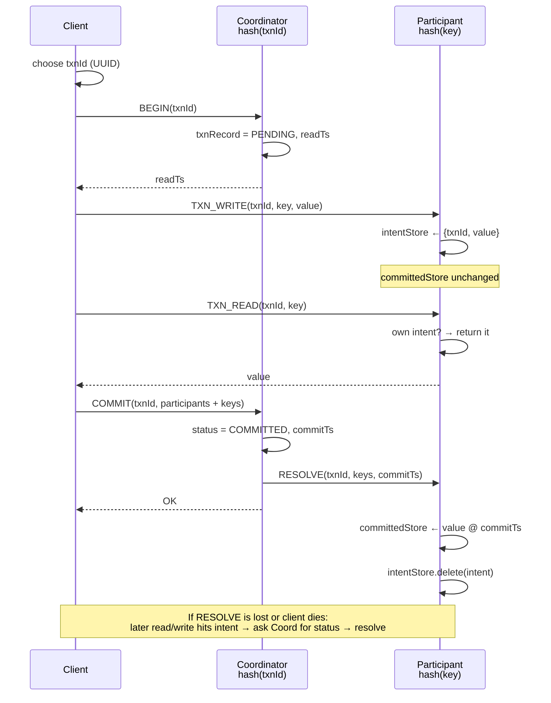
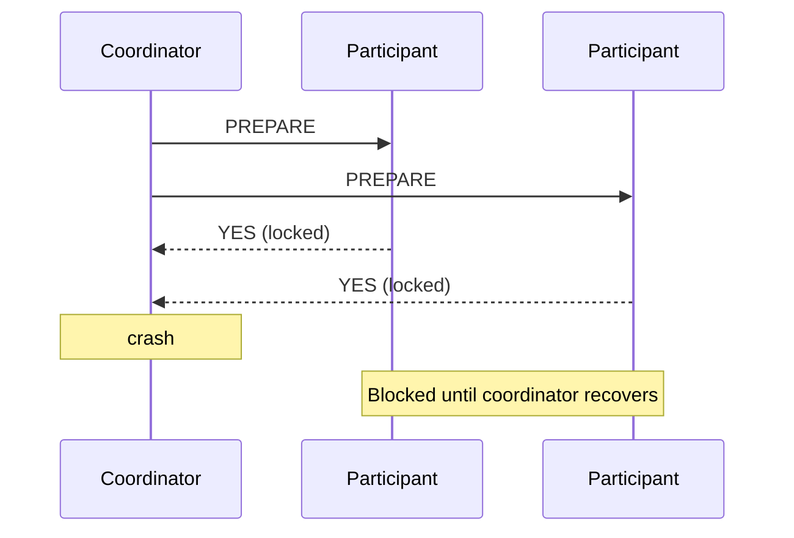
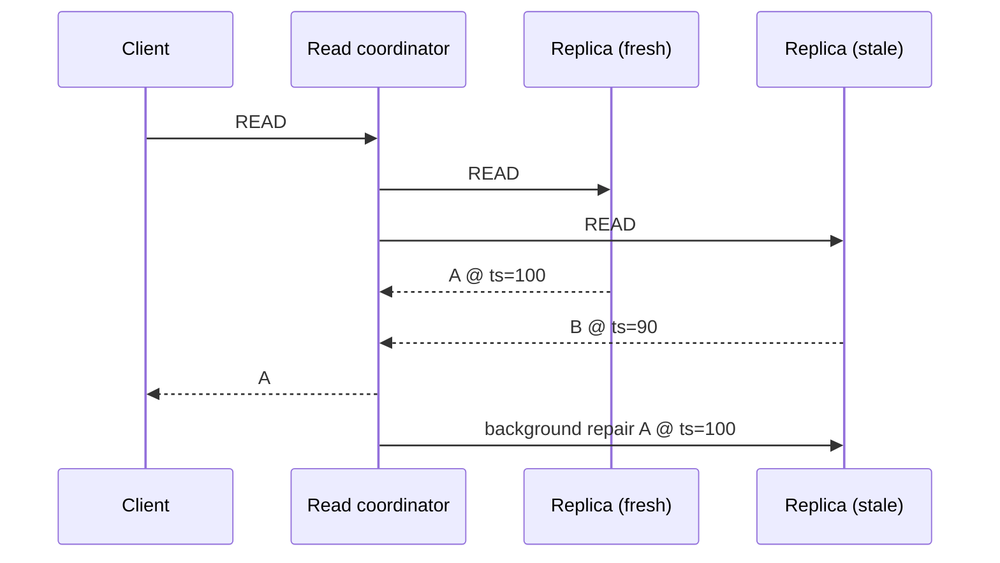

# 04 — Distributed Transactional Key-Value Store

Module `03` gave us distributed MVCC: route a key to a node, read or write a version, propagate HLC timestamps. Each operation stood alone — no `BEGIN`, no `COMMIT`, no guarantee that a batch of reads and writes happened as one unit.

This module adds **transactions**. The motivating requirement is **atomic commit**: a client does multiple reads and writes, possibly spread across nodes, and wants them to succeed or fail **together** — one atomic unit of work, not a half-applied transfer.

We're building **Snapshot Isolation (SI)** here, not full serializability (`06`) and not clock-uncertainty read restart yet (`05`). This is the main hands-on module — you'll implement pieces of `TransactionalStorageReplica.java`. See [EXERCISE.md](EXERCISE.md).

---

## What we need on top of basic key-value storage

Once you need atomic commit across nodes, module `03`'s model isn't enough. Several things have to be added.

### Writes cannot go straight to the final store

In module `03`, a write lands in the MVCC store immediately — other clients can read it on the next request. That breaks down inside a transaction:

```
T1: WRITE account → $1100     ← if this hits committedStore now...
T2: READ account              ← ...T2 sees uncommitted data
T1: aborts
```

Transactional writes going to individual nodes **cannot be exposed** to the final key-value store or to other clients until the atomic unit is decided successful. You need **provisional / intermediate storage** — our `intentStore` — plus a separate **committed** store that snapshot reads trust.

### Someone must track whether the unit succeeded — but not only on the client

When all reads and writes in a transaction finish successfully, **someone** has to record that decision and tell each participating node to publish or discard its provisional data.

The client is the natural **coordinator of work** — it's the one that knows "I'm done, commit." But the client **cannot be the sole place that tracks transaction state**. If it were:

- the client crashes after writes landed on servers but before everyone was told to commit
- messages from client to individual nodes get lost

…then nodes are stuck with provisional data and no authoritative answer on whether the transaction committed.

So: **client drives the workflow; a server holds the transaction record.** That server is the **transaction coordinator** (transaction manager). One node in the cluster is chosen per transaction — in our code, `hash(txnId) % numNodes`.

### Each node carries extra state

Apart from key-value storage (`committedStore`), each `TransactionalStorageReplica` also has:

- **`intentStore`** — provisional writes, each tagged with a **transaction ID**
- **`txnRecords`** — on whichever node is coordinator for that txn: `PENDING` / `COMMITTED` / `ABORTED`, snapshot timestamp, commit timestamp

(Production systems also **replicate** each node's state with Raft/Paxos. We skip that in this workshop — single copy per shard — but the coordinator record and intents are the logical layer that replication would persist.)

---

## End-to-end flow (as in the lecture)

This is the typical path the talk walks through, mapped to our code.

**1. Client picks a transaction ID** — usually a UUID (`TxnId`). Before any work, it designates a coordinator: `hash(txnId)` picks a cluster member.

**2. Begin** — client sends `BEGIN` to the coordinator. Coordinator creates a `TxnRecord` (`PENDING`) and returns a snapshot timestamp (`readTs`). Every later read in this transaction uses that fixed point.

**3. Reads and writes** — client sends `TXN_READ` / `TXN_WRITE` to the node that owns each key (`hash(key)`), always **tagged with the transaction ID**. Writes go to **`intentStore`** with an `IntentRecord(txnId, value)` — not to `committedStore`.

**4. Commit (when everything succeeded locally)** — client sends `COMMIT` to the **coordinator first**. Coordinator marks the transaction **committed**, assigns `commitTimestamp`, and sends resolve/commit messages to participant nodes. Participants **move** provisional data into `committedStore` and delete the intent. Only then is the write visible to other clients' snapshot reads.

**5. If messages are lost or the client dies** — participant nodes still have provisional records **with the transaction ID**. When another client reads or writes that key, the node asks the **coordinator** for transaction status and reconciles — the same *lazy repair* instinct as Cassandra **read repair** (see below). The coordinator is the source of truth; the client doesn't have to be alive for recovery to progress.



### Routing (two hashes)

| Route | By | Role |
|-------|-----|------|
| Coordinator | `hash(txnId)` | Owns `TxnRecord`, receives BEGIN/COMMIT |
| Participant | `hash(key)` | Owns key data, receives reads/writes/resolves |

One transaction often touches multiple participants; commit still goes to the coordinator. The client tracks `ParticipantWrites` — which keys it wrote on which nodes — and sends that list with `COMMIT`.

---

## Two-phase commit — two meanings

The lecture frames what we built as **two-phase commit**:

| Phase | What happens | Data visible to others? |
|-------|----------------|-------------------------|
| **1 — Provisional write** | Writes land in `intentStore` with txn id | **No** |
| **2 — Commit** | Coordinator commits; participants promote to `committedStore` | **Yes** |

Data is not exposed to other clients until phase 2 completes. That's the core 2PC *idea*: decide first, publish second.

**Classic textbook 2PC** uses a different phase 1 — **prepare votes and locks** on every participant before any data is considered committed. If the coordinator crashes after participants vote YES, they **block** holding locks, unable to commit or abort alone:



Our workshop variant **avoids prepare-phase locks**. Phase 1 is cheap intent writes; phase 2 is coordinator decision + resolve RPCs. We don't wait for every resolve ACK before telling the client commit succeeded (simplification). Tradeoff: lingering intents until resolve or lazy cleanup; no indefinite lock blocking.

---

## Lazy resolution and read repair

Resolve messages can be lost. Until a participant processes them, an intent sits on a key while `committedStore` may already have (or not have) the final version. Another transaction's read or write that hits that intent **cannot guess** — it asks the **coordinator** for txn status:

| Status | Write path | Read path |
|--------|------------|-----------|
| `PENDING` | Fail (conflict) | Ignore intent; read committed snapshot |
| `COMMITTED` | Promote intent if needed; retry write | Promote intent; read committed |
| `ABORTED` | Delete stale intent; retry write | Delete intent; read committed |

This is very similar to **Cassandra read repair**, even though the underlying consistency models differ.

In Cassandra, a partition is replicated on N nodes. A read may contact several replicas; if one is **stale**, the coordinator returns the winning version (last-write-wins by timestamp) and **repairs** stale replicas in the background. No global transaction — eventual consistency per partition.



| | Cassandra read repair | Our intent resolution |
|---|----------------------|------------------------|
| Trigger | Read finds replica mismatch | Read/write finds unresolved intent |
| Authority | Timestamps across replicas | Coordinator `TxnRecord` |
| Fix | Repair stale replica | Promote or delete intent |

Same instinct: **don't assume everyone agrees; reconcile when you touch the data.** Different problems — replica divergence vs transaction lifecycle — same lazy pattern. Cassandra also has anti-entropy repair and hinted handoff for the same "fix later" philosophy. We target **Snapshot Isolation**, not LWW eventual consistency; SI **rejects** stale writers on the same key instead of silently overwriting.

---

## Reads, writes, and isolation

### Transactional read order (`beginRead`)

1. **Own intent?** Return it (read-your-own-writes). Don't require `intentTs ≤ readTs` — intents are stamped at write time, usually after snapshot begin.
2. **Someone else's intent?** Coordinator status lookup → resolve or ignore (above).
3. **Else** — `committedStore.getAsOf(key, readTs)`.

### Snapshot Isolation — lost updates prevented

Each txn reads from fixed `readTs`. Before accepting a write on key `k`, check whether `committedStore` already has a version with timestamp **> readTs**. If yes, reject — **first committer wins**. Prevents two txns from reading the same balance and both committing over each other. HLC propagation during reads ensures clock-skewed commits still land above observing snapshots — see `lost_update_scenarios.md`.

### Snapshot Isolation — write skew still possible

SI only conflicts on the **same key**. Two txns can read overlapping rows, write **different** keys, both commit — breaking an invariant (classic on-call doctors example in `SnapshotIsolationAnomalyTest`). Module `06` addresses that.

See [isolation-level.md](isolation-level.md) for the full anomaly matrix.

---

## In the code

```
TransactionalStorageClient     — begin / read / write / commit; tracks readTs + ParticipantWrites
TransactionalStorageReplica    — committedStore + intentStore + txnRecords; handlers for all RPCs
ReplicaRouting                 — coordinatorFor(txnId), replicaFor(key)
```

**Client** (smart-client model): routes directly to coordinator vs shard owner; ticks HLC on every response.

**Replica**: implements the flow above. `onTick` evicts abandoned `TxnRecord`s via heartbeat timeout.

**Workshop exercises** ([EXERCISE.md](EXERCISE.md)):

| # | Implement | Test focus |
|---|-----------|------------|
| 1 | `beginTransaction` → `PENDING` record | `beginTransactionCreatesPendingTxnRecordOnCoordinator` |
| 2 | `writeIntent` → `intentStore` | `txnWriteStoresIntentAndReadReturnsOwnIntent` |
| 3 | `beginRead` — own intent, then committed | `txnReadCommittedValuesAtReadTimestamp` |
| 4 | `commitTransaction` — mark committed, resolve | `commitMovesIntentToCommittedStore...` |
| 5 | SI write-write validation | `SnapshotIsolationLostUpdatePreventionTest` |
| follow-on | intent resolution (provided) | `*ReadResolutionTest`, `*WriteResolutionTest` |
| discussion | write skew, clock uncertainty | `SnapshotIsolationAnomalyTest`, `ClockUncertaintySnapshotTest` |

```bash
./gradlew :04-distrib-txn-kv:test
```

---

## How the designs compare

| | Classic 2PC (prepare locks) | This module | Cassandra (classic) |
|---|----------------------------|-------------|---------------------|
| Atomic multi-key | Yes | Yes (SI) | No (LWT = Paxos per partition) |
| Phase 1 | Lock + vote | Provisional intent | Async multi-replica write |
| Phase 2 | Sync commit ACKs | Coordinator commit + resolve | LWW + read repair |
| Coordinator crash | Participants **block** | Query coordinator record; resolve intents | Hints + repair |
| Stale/conflict handling | Blocking | Intent resolution + SI check | Read repair / anti-entropy |

Production OLTP (CockroachDB, Yugabyte, Spanner) blend MVCC, distributed txn records, and validation — closer to our intent model than to blocking 2PC, and stricter than Cassandra's default path.

---

## Further reading

**In this repo:**

- [isolation-level.md](isolation-level.md)
- [lost_update_scenarios.md](lost_update_scenarios.md)
- [si_hlc_vs_timestamp_oracle_spec.md](si_hlc_vs_timestamp_oracle_spec.md)

**Cassandra / eventual consistency:**

- [Cassandra read repair](https://cassandra.apache.org/doc/latest/cassandra/managing/operating/read_repair.html)
- [Lightweight transactions (Paxos per partition)](https://cassandra.apache.org/doc/latest/cassandra/developing/cql/ltw.html)

---

## What comes next

**`05-clock-uncertainty-and-read-restart`** — snapshot reads can miss writes inside the HLC uncertainty window; read restart fixes that.

**`06-serializable-txn`** — read provisional records to prevent write skew.
